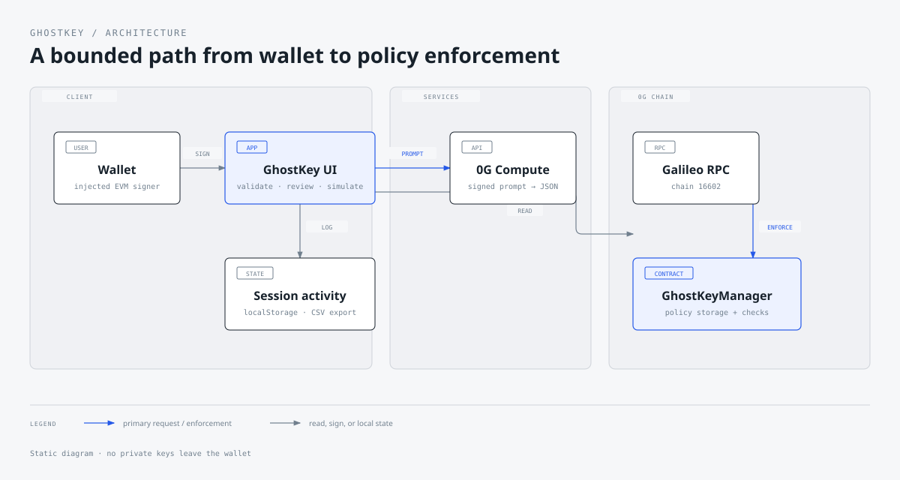
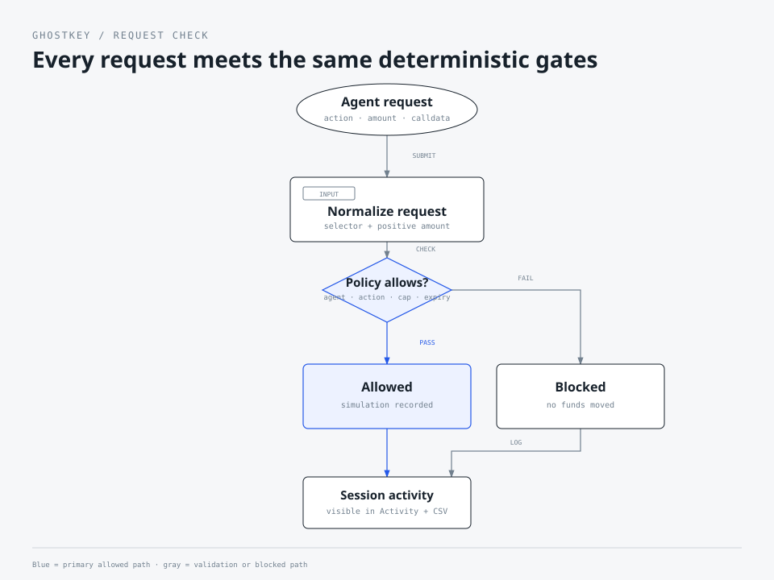
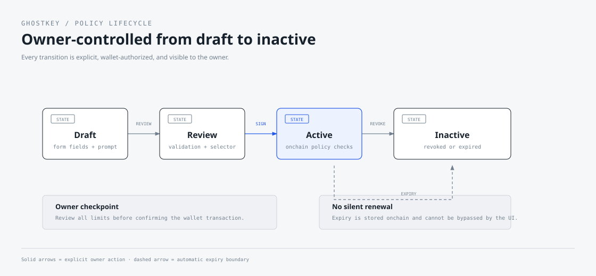

# GhostKey

GhostKey is a non-custodial permission layer for autonomous agents on the [0G Galileo testnet](https://build.0g.ai/chain). A wallet owner creates narrow, time-bound policies, reviews them before signing, simulates agent requests, and can revoke access at any time.

> **Status:** testnet-ready MVP. The app and `GhostKeyManager` contract are deployed on Galileo. Add protocol-specific calldata adapters before using real funds or moving to mainnet.

**Live app:** [ghostkey-chi.vercel.app](https://ghostkey-chi.vercel.app)

**Onchain manager:** [`0x7BB1…0778E`](https://chainscan-galileo.0g.ai/address/0x7BB1F95ed2d2869A1cf5E40aA1E9462B2B20778E) · **Network:** 0G Galileo (`16602`)

## Quick navigation

[What it does](#what-the-app-does) · [How it works](#how-it-works) · [Local development](#local-development) · [Security](#security-model-and-limitations) · [Roadmap](#improvement-checklist--roadmap)

## GhostKey in 30 seconds

| Principle | What it means |
| --- | --- |
| **Non-custodial** | The owner’s wallet signs policy changes; GhostKey never stores a private key. |
| **Deterministic** | Agent requests are checked against explicit action, selector, expiry, count, and spend limits. |
| **Revocable** | The owner can revoke a policy onchain before its expiry. |
| **Testable** | The console simulates checks without sending target-contract transactions. |

The shortest path through the product is: connect wallet → create a policy → review and sign → simulate a request → revoke when finished.

## What the app does

GhostKey splits the experience into focused surfaces:

| Surface | Purpose |
| --- | --- |
| **Overview** | Active policies, remaining budget, recent checks, and next actions. |
| **Permissions** | Create, inspect, and revoke agent policies. |
| **Agent console** | Simulate an action and amount without submitting a target transaction. |
| **Activity** | Review the browser session and export it as CSV. |

Policy creation collects an agent address, target contract, allowed action, function signature, limits, transaction count, and expiry. The app validates the inputs, derives the 4-byte selector, and asks the wallet to sign the onchain policy.

The optional **Interpret with 0G** action converts a plain-language request into a structured draft. It uses a fresh wallet signature; the owner must review the result before signing a policy.

## How it works



The browser talks to an injected EVM wallet and the configured 0G RPC. Policy writes and revokes are sent directly from the wallet to `GhostKeyManager`. The Vercel API route is only used for the optional 0G Compute interpretation and never receives a private key.



The Agent Console is intentionally a simulation surface in this MVP. It records a session result but does not call arbitrary target contracts or move funds.



## Policy model

Each policy contains:

- `agent`: the address allowed to act.
- `target`: a deployed contract address.
- `allowedSelector`: the exact 4-byte function selector accepted.
- `actions`: a bitmask; the UI currently exposes `SWAP` and `TRANSFER`.
- `maxPerTx`, `totalLimit`, and `maxTransactions`: accounting limits.
- `expiresAt`: Unix timestamp after which the policy is inactive.
- `spent` and `transactionCount`: manager-owned accounting state.

The contract validates addresses, target bytecode, selector, action set, limits, and expiry. Execution checks validate the approved agent, action, selector, expiry, per-transaction cap, total cap, transaction count, positive amount, and reentrancy.

## 0G Galileo deployment

```text
Chain ID: 16602
RPC:      https://evmrpc-testnet.0g.ai
Explorer: https://chainscan-galileo.0g.ai
```

Deployed manager: `0x7BB1F95ed2d2869A1cf5E40aA1E9462B2B20778E`

[View GhostKeyManager on Galileo](https://chainscan-galileo.0g.ai/address/0x7BB1F95ed2d2869A1cf5E40aA1E9462B2B20778E)

These settings match the official [0G Chain Builder Hub](https://build.0g.ai/chain).

## Local development

Requirements: Node.js 20+, npm 10+, an injected EVM wallet, and Galileo testnet balance for writes.

```bash
npm install
copy .env.example .env       # PowerShell: Copy-Item .env.example .env
npm run dev
```

Useful checks:

```bash
npm run format:check
npm run contract:compile
npm run build
npm run check
npm audit --omit=dev
npm run contract:verify
```

`npm run check` runs formatting, Solidity compilation, TypeScript, and the Vite production build. `contract:verify` checks the chain ID, deployed bytecode, and manager readability.

## Environment variables

Copy `.env.example` to `.env`. The local `.env` is gitignored and must not be committed.

| Variable | Description |
| --- | --- |
| `VITE_OG_CHAIN_ID` | Public Galileo chain ID; defaults to `16602`. |
| `VITE_OG_RPC_URL` | Public RPC used for reads. |
| `VITE_OG_EXPLORER_URL` | Explorer base URL. |
| `VITE_GHOSTKEY_MANAGER_ADDRESS` | Deployed manager; empty enables preview mode. |
| `VITE_ASSET_SYMBOL` | Display/accounting symbol, currently `USDC`. |
| `VITE_ASSET_DECIMALS` | Display decimals, currently `6`. |
| `OG_COMPUTE_API_KEY` | Server-only Compute credential; never use a `VITE_` prefix. |
| `OG_COMPUTE_BASE_URL` | OpenAI-compatible 0G Compute router URL. |
| `OG_COMPUTE_MODEL` | Compute model identifier. |

Only `VITE_*` values are bundled into the browser. The Compute credential is read by `api/parse-policy.ts` on the server.

## 0G Compute API

`POST /api/parse-policy` accepts a signed request:

```json
{
  "wallet": "0x...",
  "timestamp": 1730000000000,
  "prompt": "Allow my trading agent to swap up to 10 USDC per transaction for 6 hours",
  "signature": "0x..."
}
```

The route verifies the wallet signature, rejects stale requests, limits prompt length, calls the configured router, validates the JSON response, and returns only policy-form fields. HTTP 402 means the Compute account needs credits. See the official [0G Compute documentation](https://build.0g.ai/compute).

## Contract deployment

Keep the deployer key in a one-off process environment; never commit it or expose it through a `VITE_*` variable.

```bash
npm run contract:compile
$env:OG_PRIVATE_KEY = "<testnet-deployer-key>"
npm run contract:deploy
Remove-Item Env:OG_PRIVATE_KEY
npm run contract:verify
```

Deployment writes `deployments/galileo.json` and `artifacts/GhostKeyManager.json`. Generated folders are ignored by git.

## Vercel deployment

This is a Vite SPA with one serverless function under `api/`.

```bash
npx vercel login
npx vercel link
npx vercel env add VITE_OG_CHAIN_ID production
npx vercel env add VITE_OG_RPC_URL production
npx vercel env add VITE_OG_EXPLORER_URL production
npx vercel env add VITE_GHOSTKEY_MANAGER_ADDRESS production
npx vercel env add OG_COMPUTE_API_KEY production
npx vercel --prod
```

Set public `VITE_*` and server-only `OG_*` values in the project, then confirm the deployment is `Ready`. Test the homepage and `/api/parse-policy` validation response.

## Security model and limitations

Current controls:

- Non-custodial wallet signing; GhostKey never stores private keys.
- Owner-scoped agent policies and exact selector binding.
- Contract-target validation, expiry, action, spending, and transaction-count checks.
- Reentrancy guard on policy execution.
- Signed, time-bounded prompts and server-side Compute credentials.

Known limits:

- The generic manager receives an accounting amount from the caller; it cannot decode every protocol’s token amount and recipient encoding.
- The Agent Console is simulation-only.
- Activity is browser-session data, not an indexed immutable audit trail.
- This is a Galileo testnet application, not a mainnet custody product.

Do not route real funds through the generic manager until a protocol adapter validates the exact recipient, token, amount, slippage, and deadline for each supported target.

## Improvement checklist / roadmap

### Safety and protocol support

- [ ] Add protocol-specific calldata adapters.
- [ ] Enforce decoded recipient, token, amount, slippage, and deadline.
- [ ] Add a target + selector adapter registry.
- [ ] Add a multisig/guardian pause switch.
- [ ] Commission an independent Solidity audit.
- [ ] Add property-based and fuzz tests for accounting and expiry edges.

### Observability and data integrity

- [ ] Index `PolicyCreated`, `PolicyRevoked`, and execution events.
- [ ] Persist wallet-scoped activity in a durable backend.
- [ ] Track confirmations and show explorer links after writes.
- [ ] Add request IDs, structured logs, and API alerting.
- [ ] Add RPC health checks and a degraded-state banner.

### Agent and wallet experience

- [ ] Add WalletConnect and mobile-wallet support.
- [ ] Add wrong-network recovery and explicit network switching.
- [ ] Add policy templates and human-readable calldata previews.
- [ ] Add delegated session keys with scope and rotation.
- [ ] Expand beyond the `SWAP` and `TRANSFER` action bitmask.

### Compute and product quality

- [ ] Add Compute provider fallback and bounded retries.
- [ ] Show AI provenance and an editable diff before signing.
- [ ] Add rate limiting and abuse monitoring to `/api/parse-policy`.
- [ ] Add local Anvil/Hardhat end-to-end wallet tests.
- [ ] Add visual regression tests for all breakpoints.
- [ ] Add a public changelog and versioned contract migrations.

## Repository map

```text
src/                 React screens, styles, icons, and ethers helpers
api/parse-policy.ts  Signed 0G Compute interpretation endpoint
contracts/           GhostKeyManager Solidity contract
scripts/              Compile, deploy, verify, and Compute checks
docs/diagrams/       Architecture, request-flow, and lifecycle SVGs
```

## Troubleshooting

**Preview mode:** verify `VITE_GHOSTKEY_MANAGER_ADDRESS`, restart Vite, and confirm bytecode on Galileo.

**Wallet failure:** install/unlock an injected EVM wallet and switch to chain ID `16602`.

**Policy read failure:** check the Galileo network, RPC reachability, and manager address.

**Compute 402:** the configured Compute account needs credits; the app surfaces this instead of retrying forever.

**Rejected write:** check target bytecode, selector syntax, expiry, action selection, and `totalLimit >= maxPerTx`.

## License

This is an experimental testnet application. Add the project’s chosen open-source license before publishing a mainnet product.
